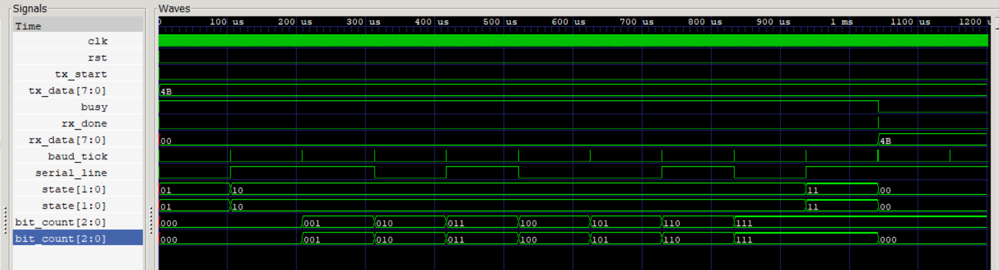

<div align="center">

# UART (Universal Asynchronous Receiver Transmitter)

### A synthesizable UART implementation in Verilog HDL featuring a configurable baud rate generator, transmitter, receiver, and top-level integration.

<p>


</p>

---

*A complete RTL implementation of the UART protocol demonstrating FSM design, serial communication, verification, and top-level hardware integration.*

</div>

---

# Table of Contents

- Overview
- Features
- Architecture
- Project Structure
- Modules
- UART Frame
- FSM Design
- Simulation
- Results
- Tools Used
- Learning Outcomes
- Future Improvements
- License

---

# Overview

UART (Universal Asynchronous Receiver Transmitter) is one of the most widely used serial communication protocols in digital systems. It enables asynchronous communication between devices without requiring a shared clock.

This project implements an entire UART subsystem completely in Verilog HDL including:

- Baud Rate Generator
- UART Transmitter
- UART Receiver
- Top-Level UART Integration
- Complete Verification Testbench

The design has been simulated and verified using **Icarus Verilog** and **GTKWave**.

---

# Features

| Feature | Status |
|---------|:------:|
| Baud Rate Generator | ✅ |
| UART Transmitter | ✅ |
| UART Receiver | ✅ |
| Top-Level Integration | ✅ |
| FSM Based Design | ✅ |
| Functional Simulation | ✅ |
| GTKWave Verification | ✅ |
| 8-bit Data | ✅ |
| 1 Start Bit | ✅ |
| 1 Stop Bit | ✅ |
| 8N1 UART Format | ✅ |
| Synthesizable RTL | ✅ |

---

# Architecture

```
                  +----------------------+
                  |   Baud Generator     |
                  +----------+-----------+
                             |
                        baud_tick
                             |
              +--------------+--------------+
              |                             |
      +-------v--------+             +------v-------+
      | UART TX        |------------>| UART RX      |
      +----------------+ Serial Line +--------------+
```

---

# Project Structure

```
UART
│
├── screenshots/
│   └── uart_top_waveform.png
│
├── rtl/
│   ├── baud_gen.v
│   ├── uart_tx.v
│   ├── uart_rx.v
│   └── uart_top.v
│
├── tb/
│   ├── baud_gen_tb.v
│   ├── uart_tx_tb.v
│   └── uart_top_tb.v
│
├── sim/
│
├── .gitignore
├── LICENSE
└── README.md
```

---

<details>
<summary>

# Baud Rate Generator

</summary>

### Function

Generates a baud tick from the 50 MHz system clock.

### Inputs

- clk
- rst

### Outputs

- baud_tick

### Working

The internal counter counts clock cycles until the programmed baud divisor is reached. A single-cycle pulse (`baud_tick`) is generated and the counter resets.

</details>

---

<details>
<summary>

# UART Transmitter

</summary>

## Inputs

- clk
- rst
- tx_start
- tx_data
- baud_tick

## Outputs

- tx
- busy

## FSM

```
IDLE
 ↓
START
 ↓
DATA
 ↓
STOP
 ↓
IDLE
```

### Operation

- Waits for transmission request
- Stores input byte
- Sends Start Bit
- Sends 8 Data Bits (LSB First)
- Sends Stop Bit
- Returns to Idle

</details>

---

<details>
<summary>

# UART Receiver

</summary>

## Inputs

- clk
- rst
- rx
- baud_tick

## Outputs

- rx_data
- rx_done

## FSM

```
IDLE
 ↓
START
 ↓
DATA
 ↓
STOP
 ↓
IDLE
```

### Operation

- Detect Start Bit
- Receive one bit every baud tick
- Store received bits
- Validate Stop Bit
- Output received byte
- Assert rx_done

</details>

---

<details>
<summary>

# UART Top Module

</summary>

The top module integrates:

- Baud Generator
- UART TX
- UART RX

The transmitter serial output is internally connected to the receiver serial input for functional verification.

</details>

---

# UART Frame

```
Idle

1

 ┌──────┬────┬────┬────┬────┬────┬────┬────┬────┬──────┐
 │Start │D0  │D1  │D2  │D3  │D4  │D5  │D6  │D7  │ Stop │
 └──────┴────┴────┴────┴────┴────┴────┴────┴────┴──────┘

0                                                   1
```

Transmission Order

```
Start → D0 → D1 → D2 → D3 → D4 → D5 → D6 → D7 → Stop
```

---

# Simulation

The integrated UART was verified using a top-level testbench.

Simulation sequence:

- Apply Reset
- Generate Baud Tick
- Transmit **8'h4B**
- Serialize Data
- Receive Serialized Data
- Validate Reception
- Assert rx_done

---

# Results

## Waveform

```

```

The simulation confirms:

- Correct Reset Behaviour
- Correct Baud Tick Generation
- Proper UART Frame Transmission
- Correct FSM Operation
- Bit Counter Progression
- Successful Data Recovery
- Correct Reception of **0x4B**

---

# Tools Used

| Tool | Purpose |
|-------|---------|
| Verilog HDL | RTL Design |
| Icarus Verilog | Simulation |
| GTKWave | Waveform Analysis |
| Visual Studio Code | Development |
| Git | Version Control |
| GitHub | Repository Hosting |

---

# Learning Outcomes

This project provided hands-on experience with:

- RTL Design
- FSM Design
- UART Communication Protocol
- Serial Communication
- Verilog HDL
- Testbench Development
- Functional Verification
- Top-Level Integration
- Module Hierarchy
- Waveform Debugging
- Digital Hardware Design

---

# Future Improvements

- Configurable Baud Rate
- Configurable Data Width
- Parity Support
- Multiple Stop Bits
- Oversampling Receiver
- FIFO Buffers
- Error Detection
- Interrupt Support
- APB Interface
- AXI-Lite Wrapper
- FPGA Implementation

---

<div align="center">

## Author

**Tanish Yadav**

Digital Design • RTL Design • Verilog HDL • FPGA Enthusiast

---

⭐ If you found this project useful, consider giving it a star.

</div>

---

# License

This project is licensed under the MIT License.